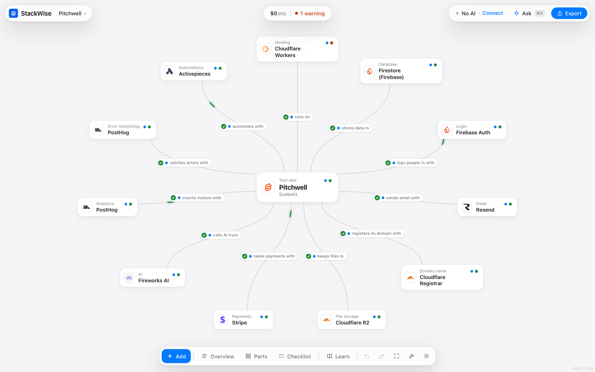
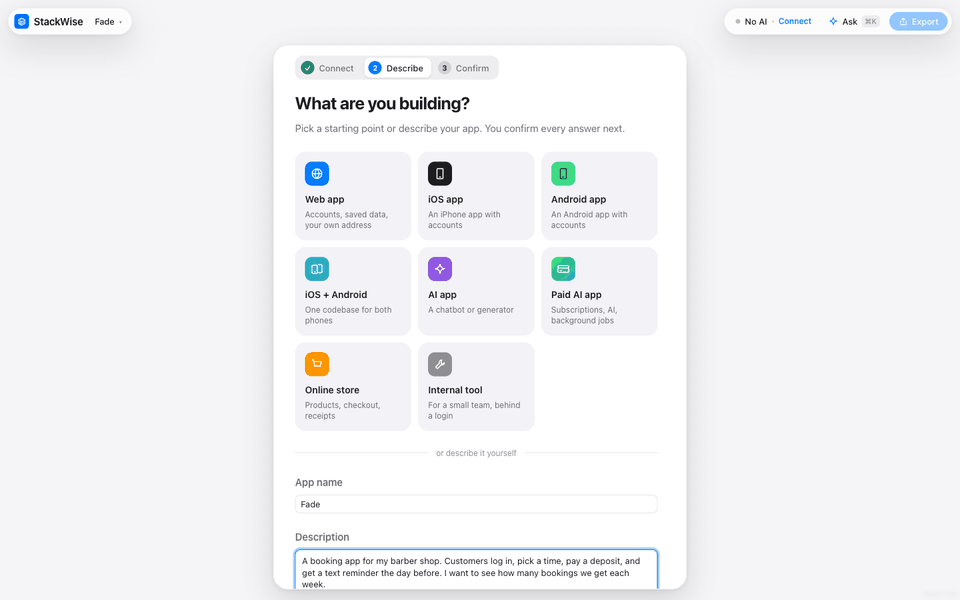

# StackWise

Plan a web app stack you actually understand.

You describe your app in a paragraph. StackWise works out what it needs (logins, payments, uploads, email, live updates, background jobs, data from other websites, your own domain), asks you to confirm each guess, and fills a canvas with a host, domain, database, login, file storage, payments, email, AI provider, web scraper, jobs service, analytics, error monitoring and, if you want one, a phone app. A rules engine checks every connection against sourced facts, so each verdict comes with a reason and a link. When the plan looks right, StackWise hands your AI builder (Lovable, Bolt, Replit, Claude Code, Cursor) a spec pack: the spec, an ordered setup checklist, a prompt or agent file, and a decision record.

The AI never decides whether two services work together. Rules do, from facts with a source and a date. AI reads your description, explains the plan and drafts new facts for a person to review.





A two-minute walkthrough for a video or an interview is in [docs/DEMO.md](docs/DEMO.md).

## Start in two minutes

You need Node 22.9 or newer and pnpm. Claude Code is optional, for working with an agent.

```bash
git clone https://github.com/Mikey-Ku/StackWise.git stackwise && cd stackwise
pnpm install
pnpm link --global     # adds the `stackwise` command
stackwise setup        # once: lets Claude Code talk to StackWise
```

Then, in any project folder:

```bash
stackwise
```

StackWise starts in the background (on http://localhost:4310) and opens your browser on that project. If the folder has a `stackwise.plan.json`, that plan opens; if you've opened the folder before, its plan comes back; otherwise a new plan starts, named after the folder, with its README as the description and its framework recognized. `stackwise stop` stops it.

To build with an agent, open Claude Code in the same folder and run `/mcp__stackwise__pair`. Write to it from **Ask** in StackWise (Cmd+K); it works in your repo and answers there.

Or just run the app: `pnpm dev` and open http://localhost:4310.

Everything works without an API key. To have an AI read your description, answer questions and explain your plan, copy `.env.example` to `.env.local` and set `ANTHROPIC_API_KEY` (or `OPENAI_API_KEY`, `GEMINI_API_KEY`, or any model listed there).

## Using it

1. **Connect your AI.** The first screen: a coding agent in your terminal or an API key. The pill in the top bar always says what's connected.
2. **Say what you're building.** Pick a kind of app (web, iOS, Android, both, AI app, store, internal tool) or describe it, then confirm each guess.
3. **Read the canvas.** Your app in the middle, a card per part, and a line per connection: a check means it works, `!` a warning, a cross that it doesn't. A light flows along the lines that work. Click a card for why it was picked; right-click anything for everything else; press A to add a part.
4. **Ask.** Cmd+K opens one conversation per plan. Pick who answers: an agent in your terminal, a model with a key, or StackWise's own facts.
5. **Turn on Advanced tools when you need them.** The wrench in the dock adds a second service in one part (a cache next to the database), lines between two parts (Stripe sends webhooks to your app), parts you build yourself and parts StackWise doesn't list, and the Project panel.
6. **Link your project.** The Project panel runs the app, sets environment variables, checks every service with your keys, reads the database (read only) and gives extra agents their own git worktree.
7. **Export.** A spec pack for your AI builder, or the files written straight into the project. "Copy the build plan" on the canvas menu gives the tasks alone, in order.

```bash
pnpm test             # engine, AI (with a fake client), store, scripts and data checks
pnpm check:data       # only the data checks: schemas, sources, every pair gets a verdict
pnpm check:options -- --id firecrawl   # check one option file while you write it
pnpm typecheck && pnpm lint && pnpm build

pnpm eval:questions   # the question ids eval cases can grade, no AI
pnpm eval:prefill     # AI pre-fill vs the keyword baseline (needs cases in evals/)
pnpm eval:plain-llm   # how often a plain LLM picks a stack that breaks a rule
pnpm check:sources    # reread every fact's source page with Claude; --apply to update
pnpm draft:option -- --id resend --name "Resend" --slot email --website https://resend.com
pnpm build:logos      # refetch logos into public/logos; -- --only <id,id> for a few
pnpm mcp              # StackWise's MCP server over stdio (exported projects start it themselves)
```

## Pair with a coding agent

StackWise is also an MCP server, so your coding agent uses its rules instead of guessing. Open **Ask** (Cmd+K), pick your agent in the Answering menu, then add StackWise to Claude Code once (any agent that speaks MCP can connect to the same address) and run `/mcp__stackwise__pair` so you can write to it from StackWise:

```bash
claude mcp add --transport http --scope user stackwise http://localhost:4310/api/mcp
```

Claude can check stacks, compare options, estimate costs and change the plan you share; its changes appear on the canvas with its reasons, and Undo reverses them. **Export project** gives Claude Code a ready project: tasks, an agent per part, `/next-step`, and an `.mcp.json` that starts StackWise's server. See [docs/MCP.md](docs/MCP.md).

## What it does

**Planning**
- Describe your app, or start from an example. Claude (or keywords, without a key) guesses what it needs and shows the exact words behind every guess. Guesses whose quoted words aren't really in your description are thrown out.
- Only the follow-up questions that would change your plan are asked.
- Pick a priority (spend $0, launch fast, learn, ready to grow), an audience size and your builder.

**Getting started**
- Connect your AI first: a coding agent in your terminal (Claude Code, Codex, Gemini CLI) or an API key (Claude, OpenAI or Gemini). A pill in the top bar always shows what's connected, and you can change it there. StackWise's facts work with nothing connected.
- Start from a kind of app (web, iOS, Android, iOS and Android, AI app, online store, internal tool) or describe yours. A template's answers are guesses you confirm like any other.

**The canvas**
- The canvas fills the window. A bar on top holds your plans, the plan in one line (monthly cost, accounts, checks) and Ask; a dock at the bottom opens Overview, Parts, Checklist and Learn, with undo, redo and fit to screen. Light and dark follow your system.
- Add parts the way you add nodes in n8n: press A, the + in the dock or the + on your app, search every service, and pick one. The dot beside each shows what the rules say it would do to your plan. Hover a card to ask about it, swap it or remove it; Delete removes the selected one.
- Every line starts with a mark that says whether it's connected: a check, a warning, a cross, or a question mark when it isn't verified. When a line is made or changes, a pulse runs along it and the mark pops, so you see the change as it happens.
- Cards stay small: a logo, a name and a dot for its verdict. Click one for Details, double-click to ask about it, right-click for everything else (ask, swap, let StackWise pick, learn, clear). Right-click a line to explain the connection or copy its variable names, and the empty canvas to add parts, show all parts, tidy up, undo or edit your answers.
- Your app in the middle, with slots for hosting, domain name, database, login, email, file storage, payments, AI, web scraping, background jobs, analytics, error monitoring and a phone app. Optional parts stay hidden until you need them, drag something that fits, or show all parts.
- Drag options from a palette of 101 (80 fully researched), or press Use. Every option has its logo, a dot for what would happen if you used it, and quick stats at your audience size: cost now, the first paid plan, how far the free plan goes, and the trait that matters for that part (a domain's renewal price, whether a scraper charges extra for JavaScript pages, whether analytics needs cookies, whether a free host falls asleep, download fees, sales tax, whether iPhone builds need a Mac). Dropping something in the wrong slot is refused with a reason.
- Drag any part where you want it: the lines follow it as it moves. The layout is saved with the plan, and "Tidy up" puts everything back.
- Every line between the app and a service says what runs along it: the environment variables your code reads to reach that service. Click a line to see each name, where its value comes from, which ones the browser can read, and the checks on that connection. The line to your host carries every variable in the plan, because the host needs them all.
- Swap a service without leaving the canvas: right-click any part and "Swap for" lists the others that fit it.
- Describing your app and confirming the guesses happen in a sheet over the canvas. In a small window, panels slide up from the bottom.
- Lines stay grey when they work, so the ones with a warning, a problem or an unverified fact stand out in color.
- Undo and redo (Cmd or Ctrl+Z).

**Notes and asking**
- Write a note on any part and the line to it: how it should work, what you decided, what whoever builds it should know. A dot on the card and the line shows it, and a note written before you swapped the service is flagged.
- Ask (Cmd+K, the Ask button, or right-click "Ask about this") opens one floating panel and one conversation per plan. The Answering menu picks who answers: a coding agent in your terminal (Claude Code, Codex, Gemini CLI), the Claude API, or StackWise's own facts. It defaults to Claude, and you can save your own default. Ask how to set it up, which keys it needs, what could go wrong or what else would work. Claude answers from StackWise's facts and checks for that part, not from memory. Without a key, StackWise answers the same questions from its own facts.
- Claude (or StackWise's facts) can suggest a note or a switch. A suggested switch shows the verdict StackWise's rules give it right now, and nothing changes until you accept, as one step Undo reverses.
- Notes travel with the plan: share links, plan files, SPEC.md, each part's build agent, and pairing, where Claude Code can read and write them too.

**Your project, live**
- Link a plan to its project folder in the Project panel. StackWise reads what it is (Next.js, Spring Boot, Django, Rails and more), how to run it, and which Java or Node it needs.
- Start and stop the app from StackWise and watch its log. Its health check shows whether it's up.
- Every environment variable the plan needs, marked set, missing or readable by the browser. Paste a value to write it into the project's `.env.local`; StackWise never shows it again or sends it anywhere.
- Check every service with your own keys: one read-only request each, shown with the keys masked, what came back, an example of what travels on that connection, and a link to the service's status page.
- A read-only SQL console for the project's Postgres or SQLite database.
- The plan file in the project and StackWise's copy merge instead of overwriting each other, so an agent in your terminal and you in the browser can both change the plan.

**Understanding**
- Details for every part: its stats, every check with its reason and fix, the cost at your size, how it scored for your priority, a comparison table, and the sourced facts behind it, flagged when they may be out of date.
- Compare two or three options side by side, stat by stat, each with its note and source.
- "Explain my plan": a plain-language summary written only from the computed plan.
- Learn: what each part of an app is, what matters when choosing, where beginners slip, and a glossary of 50 terms.
- Close calls, and what would change if a "not sure" answer turned out to be yes.
- Cost at every audience size, and a line for each part of the plan, so you see each free plan run out before it happens. Domains are counted by the year, app store accounts as yearly and one-time fees, hosting shows the traffic each plan includes, and one subscription that covers several parts (like a Supabase plan) is counted once.

**Leaving with a plan**
- Project pack, as a zip: SPEC.md, SETUP.md, TASKS.md, DECISIONS.md with the reasoning for every part, the plan file, `.env.example` with every variable name grouped by service, a `.gitignore` that keeps the values out of git, and PROMPT.txt, AGENTS.md or CLAUDE.md for your builder. For Claude Code it adds `.mcp.json`, a build agent per part, a stack guard, a setup guide, a reviewer and a `/next-step` skill. Environment variable names follow your framework.
- Or write the same files straight into a folder on this computer, plus a `.env.local` with the names and no values, ready to open with `claude`. StackWise only writes inside your home folder, never writes over an existing `.env.local`, and tells you which names yours is missing.
- A build plan from the canvas: every part, extra service, part added by hand and line between two things becomes a task, in an order where each only needs the ones above it, with the person's notes and what "done" means. It's TASKS.md in the export, "Copy the build plan" on the canvas, and `get_build_plan` over MCP; right-click a part or a line and "Build this with Claude Code" (or any paired agent) sends that one task.
- Pair a coding agent through StackWise's MCP server: 14 tools, a shared plan, and two-way chat. Run `/mcp__stackwise__pair` in Claude Code, write to it from StackWise, and it works in your project and answers in the Ask panel, with the files it changed.
- Build checklist: every account, key and build step in order, checked off as you go.
- Copy the reasoning for one part, to paste into a proposal or pull request.
- Several saved plans, share links (the whole plan lives in the link, no account needed), and plan files to export and import.

**Keeping the facts true**
- Facts live in `data/` as reviewed JSON with a source, a date and a status.
- A weekly GitHub workflow rereads every source with Claude and opens a pull request with anything that changed.
- `draft:option` researches a new service into a draft file for review.

## Not built yet

- Accounts and syncing plans across devices (plans live in your browser; share links and plan files move them)
- Checks for services StackWise doesn't list, and for lines between two parts that no rule reads (they say "not checked")
- Planning a phone app on its own (a phone app can be added to a web plan today)
- The eval cases: `evals/prefill-cases.json` is empty on purpose, see [evals/README.md](evals/README.md)
- Reviewed facts: every fact is still a draft until someone checks it on `/review` (plan menu, Review facts), see [docs/DATA.md](docs/DATA.md)

## Where things are

```
data/                 everything StackWise knows, as JSON
  options/*.json      one file per service, with sourced facts
  rules/              capability.json and product.json
  needs.json          the questions a beginner answers
  facts.json          what each fact means and its allowed values
  slots.json          the parts of an app
  learn.json          teaching content and glossary
  logos.json          where each option's logo comes from
  planning.json       sizes, priorities and weights, builders
public/logos/         the logo files, committed
src/engine/           the logic, no React, fully tested
src/ai/               Claude pre-fill and explanations, optional
src/components/       the workspace UI
src/app/api/          status, prefill, explain, talk, keys, mcp, pair, project and local routes
src/project/          a linked project folder: run it, its env files, live checks, read-only SQL, git
src/mcp/              the MCP server, its stdio command, and shared plans in .stackwise/
scripts/              evals, source checker, option drafter, logo fetcher
evals/                eval cases (written by a person) and how to run them
docs/                 DECISIONS.md, LEARNING.md, DATA.md, MCP.md, DEMO.md, images/
```

Start with [docs/LEARNING.md](docs/LEARNING.md) for how it works, and [docs/DECISIONS.md](docs/DECISIONS.md) for why it's shaped this way.

## Safety

StackWise runs on your computer and can run your app, write project files, save AI keys to its own `.env.local` and read your database, so it only answers you:

- It listens on 127.0.0.1, never on your network.
- Its API answers only StackWise's own page (checked with the Origin and Sec-Fetch-Site headers) and programs on this computer, like Claude Code. Every POST must be JSON.
- It never shows a key or env value back to the page, runs your app with a clean environment, and opens databases read-only.
- Don't put it behind a proxy or on a server as it is: it has no accounts. `STACKWISE_PAIRING=off` turns off pairing and everything that writes files. For a public copy, use hosted mode below.

## Run it yourself

The full StackWise runs on your computer (see [Start in two minutes](#start-in-two-minutes)): pairing with a coding agent, AI keys, the Project panel and writing files all need that.

A hosted copy is the planner, the canvas, Learn and the export as a zip, with plans kept in each visitor's browser. Build it with `NEXT_PUBLIC_STACKWISE_HOSTED=1` set (on Vercel, add it as an environment variable before the first deploy). In a hosted copy:

- Every route that reaches into a computer answers 404: the MCP server, pairing, the project folder, writing files, saving keys and fact review. Setting `STACKWISE_HOSTED=1` at run time closes them too, even in a build made without the flag.
- The page leaves out the Connect screen, the Project panel, folder links and the "write into a folder" part of Export, and answers from StackWise's facts.
- The built-in AI stays off even if a key is set, because anyone could spend it. `STACKWISE_HOSTED_AI=on` turns it on, with the hourly limit per server instance.

## License

The code and data are MIT licensed (see [LICENSE](LICENSE)). Logos belong to their owners and are only used to name each service; see [THIRD_PARTY_NOTICES.md](THIRD_PARTY_NOTICES.md).
